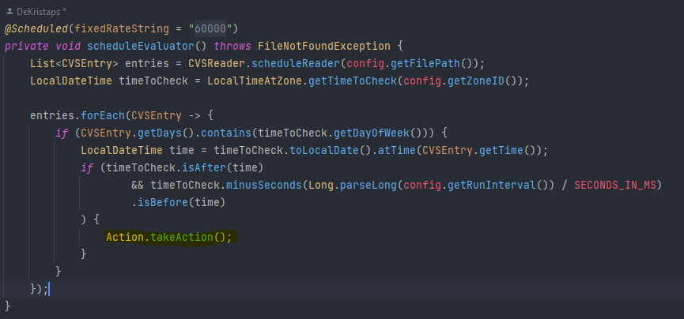

<h1>Action scheduler</h1>

This is an Action scheduler that runs in a configurable interval, and can read a CVS File containing 
a time in HH: MI format, and a mask determining on which days the action should be made. 
For instance 1 in binary equals 1 so the task would run on Mondays while 5 equals 101 so the task 
would run on Mondays and Wednesdays

The program can be configured with:

* Zone ID for checking times in different countries.
* A run interval in ms (after which the program opens the file again and checks the days and times listed).
Any file location.
* The program can be configured in the application.properties file.

After hitting run the program executes immediately and then only after the specified interval

By default, the app reads the added file(ActionTimes.csv) in the resources folder, but can be changed in the 
application.properties

At the moment program calls the Action class with a void methode that prints - "It's time to do something" 
This can be changed here -> 

